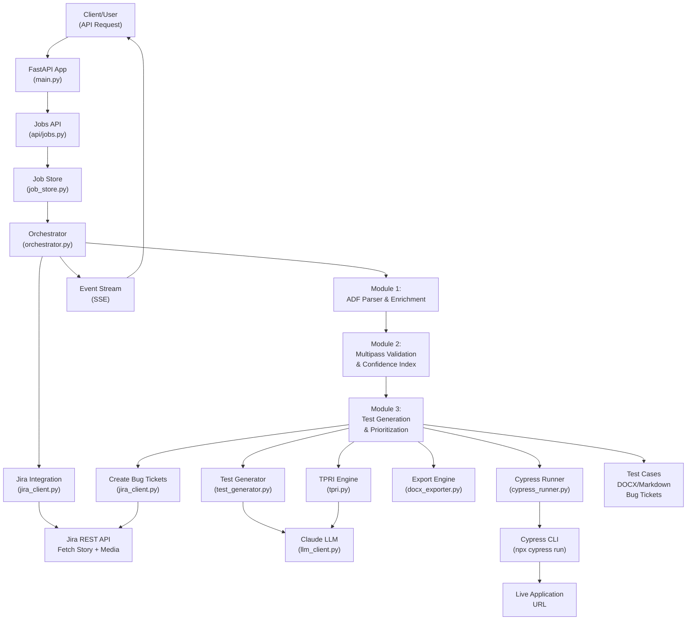

# AIspect Architecture & Data Flow Guide
## Module 3 as Central Focus

---

## 1. System Overview

AIspect is a **Jira-driven story processing pipeline** that automatically generates, prioritizes, and validates test cases using AI-powered analysis. The system processes user stories through three sequential modules:

- **Module 1**: Enriches acceptance criteria through ADF parsing, screen classification, and implicit element inference
- **Module 2**: Validates discrepancies through multi-pass validation and confidence scoring
- **Module 3**: Generates TPRI-ranked tests, executes them via Cypress, and creates Jira bug tickets

**Module 3 is the final stage** that transforms raw confidence scores and discrepancies into actionable test cases and confirmed bugs.

---

## 2. System Architecture Diagram



---

## 3. Entry Points & Request Flow

### 3.1 Starting a Pipeline Job

**Endpoint**: `POST /api/jobs`

**Request**:
```json
{
  "story_key": "EXC-1",
  "app_url": "https://app.example.com"
}
```

**Handler**: [backend/api/jobs.py](backend/api/jobs.py#L18-L28)

```python
@router.post("")
async def start_job(req: StartJobRequest, background: BackgroundTasks):
    job = job_store.create(req.story_key)
    background.add_task(process_one_story, job, req.story_key, req.app_url)
    return {"job_id": job.id, "story_key": req.story_key}
```

**Flow**:
1. Creates a Job object with a unique ID and event queue
2. Schedules `process_one_story()` as a background task
3. Returns immediately with `job_id` for polling/streaming

---

### 3.2 Polling & Streaming Progress

**Polling**: `GET /api/jobs/{job_id}`
- Returns current job state (status, step, result, error)

**Streaming**: `GET /api/jobs/{job_id}/stream`
- Server-Sent Events stream of progress events
- Emits `{"step": "step_name", "payload": {...}}` events
- Clients subscribe to real-time updates

---

## 4. End-to-End Data Flow

### 4.1 Orchestrator Execution Pipeline

**File**: [backend/pipeline/orchestrator.py](backend/pipeline/orchestrator.py)

The orchestrator is the **central coordinator** that manages the entire pipeline flow. Key stages:

#### Stage 1: Fetch & Parse Story
```
Input:  story_key (e.g., "EXC-1")
↓
Fetch from Jira (jira_client.fetch_single_story)
↓
Parse ADF description (adf_parser.parse_adf)
↓
Download embedded design images
↓
Output: {
  "story_text": str,
  "nav_path": str,
  "explicit_ACs": List[str],
  "media_uuids": List[str]
}
```

#### Stage 2: Module 1 — Enrichment & Classification
```
Input:  parsed story + design images
↓
Screen Type Classification
  → classify_screen_type(parsed)
  → Returns: "login" | "signup" | "dashboard" | etc.
↓
Compute UVRI (pre-enrichment)
  → compute_uvri(explicit_ACs, screen_type)
  → Returns: uvri_score, subterms
↓
Implicit Element Inference
  → infer_implicit_elements(parsed, screen_type)
  → Returns: List of implicit ACs
↓
Compute UVRI (post-enrichment)
↓
Output: {
  "explicit_ACs": List[dict],
  "implicit_ACs": List[dict],
  "enriched_ACs": List[dict],
  "screen_type": str,
  "uvri_pre": float,
  "uvri_post": float
}
```

#### Stage 3: Module 2 — Multipass Validation
```
Input:  enriched_ACs + design images
↓
Run 5-pass validation
  → multipass_validator.run_multipass_validation(
      enriched_ACs, design_images, n=5
    )
  → Each pass analyzes discrepancies independently
  → Returns: List of validation passes with findings
↓
Compute Confidence Index
  → confidence_index.compute_confidence_index(passes)
  → Aggregates multi-pass results
  → Returns: verified_discrepancies with confidence scores
↓
Output: {
  "verified_discrepancies": [
    {
      "discrepancy_id": str,
      "ac_text": str,
      "requirement_id": str,
      "discrepancy_type": str,  # e.g., "Missing_Element"
      "description": str,
      "confidence_index": float (0.0-1.0),
      "confidence_label": "HIGH" | "MEDIUM" | "LOW",
      ...
    }
  ]
}
```

#### Stage 4: Module 3 — Test Generation & Prioritization
```
Input:  verified_discrepancies + enriched_ACs + story context
↓
[See detailed Module 3 flow below]
↓
Output: {
  "tests": [...],
  "cypress_results": [...],
  "bugs_created": [...]
}
```

---

## 5. Module 3: Detailed Architecture & Data Flow

Module 3 has **two main operational modes**:

### 5.1 Mode 1: Coverage-First Test Generation

**Purpose**: Generate comprehensive test cases for all acceptance criteria (not just discrepancies)

**File**: [backend/pipeline/module3/test_generator.py](backend/pipeline/module3/test_generator.py)

**Flow**:
```
generate_coverage_tests(enriched_acs, user_story, story_key)
  ↓
For each AC:
  ├─ Normalize AC (extract text, type, id)
  ├─ Call LLM (Claude):
  │  └─ Prompt: "Generate positive/negative/boundary tests for this AC"
  ├─ Parse JSON response: [
  │   {
  │     "scenario": "...",
  │     "type": "positive|negative|boundary",
  │     "priority": "High|Medium|Low",
  │     "steps": [...],
  │     "expected_result": "..."
  │   },
  │   ...
  │ ]
  └─ Create TC records:
     {
       "tc_id": "TC-M1-001",
       "mode": "coverage_first",
       "ac_id": "AC-01",
       "scenario": "...",
       "priority": "Medium",
       "steps": [...],
       "expected_result": "...",
       "tpri_score": None,
       "cypress_script": None,
       ...
     }
  ↓
Return: List[dict] of test cases
```

**Data Contract**: Each Mode 1 test has:
- `tc_id`: Test case ID (TC-M1-XXX)
- `mode`: "coverage_first"
- `ac_id`: Associated acceptance criterion
- `scenario`, `steps`, `expected_result`: Test details
- `priority`: High/Medium/Low
- `tpri_score`, `priority_rank`: None (not ranked by TPRI)

---

### 5.2 Mode 2: Defect-First Test Generation & Prioritization

**Purpose**: Generate targeted Cypress tests for HIGH-confidence discrepancies, ranked by TPRI priority

**Files**:
- [backend/pipeline/module3/tpri.py](backend/pipeline/module3/tpri.py) — Prioritization
- [backend/pipeline/module3/test_generator.py](backend/pipeline/module3/test_generator.py) — Test generation
- [backend/pipeline/module3/cypress_runner.py](backend/pipeline/module3/cypress_runner.py) — Execution

**Flow**:

#### Step 1: Filter & Prioritize Discrepancies

```python
prioritize_discrepancies(
  discrepancies,         # From Module 2
  enriched_acs,          # From Module 1
  user_story,            # Story text
  weights=None
)
```

**Logic**:
```
For each discrepancy:
  ├─ Skip if confidence_index < CI_HIGH_THRESHOLD
  ├─ Compute TPRI score:
  │  ├─ CI (Confidence Index): From Module 2 (0.0-1.0)
  │  ├─ ST (Severity Type): Lookup from SEVERITY_LOOKUP dict
  │  │  ├─ Missing_Element: 1.0
  │  │  ├─ Business_Rule_Violation: 0.9
  │  │  ├─ Interaction_Flow_Error: 0.7
  │  │  ├─ Wrong_Label: 0.6
  │  │  └─ Layout_Constraint_Mismatch: 0.4
  │  ├─ RC (Requirement Criticality): Call LLM
  │  │  └─ Prompt: "Score business criticality 0.0-1.0"
  │  ├─ FS (Feature Similarity): Jaccard similarity to other ACs
  │  │  └─ Counts how many ACs share > 20% token overlap
  │  └─ TPRI = (α·CI + β·ST + γ·RC + δ·FS) / (α+β+γ+δ)
  │     Default weights: 0.25 each
  └─ Return enriched discrepancy with TPRI components

Sort by (tpri_score DESC, confidence_index DESC)
Assign priority_rank (1, 2, 3, ...)
```

**Example Output**:
```json
{
  "discrepancy_id": "DISC-001",
  "ac_text": "Login button must be clickable",
  "description": "Login button is not responsive on Firefox",
  "confidence_index": 0.92,
  "discrepancy_type": "Interaction_Flow_Error",
  "ci": 0.92,
  "st": 0.7,
  "rc": 0.85,
  "rc_reasoning": "Login is central to user experience",
  "fs": 0.15,
  "tpri_score": 0.805,
  "priority_rank": 1
}
```

#### Step 2: Generate Cypress Test Scripts

```python
generate_mode2_tests(
  prioritized_discrepancies,
  app_url,
  ticket_id,
  story_key
)
```

**Logic**:
```
For each HIGH-priority discrepancy (in TPRI order):
  ├─ Call LLM: "Generate Cypress test to verify this discrepancy"
  │  └─ Prompt includes:
  │     - Discrepancy description
  │     - AC text
  │     - App URL
  │     - Instructions for Cypress syntax
  │
  ├─ Parse response as Cypress .cy.js script:
  │  └─ describe('Defect check: ...', () => {
  │       it('validates...', () => {
  │         cy.visit(app_url);
  │         // Custom commands to check discrepancy
  │       });
  │     });
  │
  └─ Create test record:
     {
       "tc_id": "TC-M2-001",
       "mode": "defect_first",
       "cypress_script": "...",
       "tpri_score": 0.805,
       "priority_rank": 1,
       "ci": 0.92,
       "st": 0.7,
       "rc": 0.85,
       "fs": 0.15,
       ...
     }
```

**Data Contract**: Each Mode 2 test has all Mode 1 fields PLUS:
- `tpri_score`, `priority_rank`: From TPRI computation
- `ci`, `st`, `rc`, `fs`: TPRI components
- `cypress_script`: Executable Cypress code
- `discrepancy_id`: Linked to original discrepancy

---

### 5.3 Cypress Execution & Bug Confirmation

**File**: [backend/pipeline/module3/cypress_runner.py](backend/pipeline/module3/cypress_runner.py)

**Flow**:
```python
run_cypress_tests(tests)
  ↓
For each test with mode="defect_first":
  ├─ Write cypress_script to temp file: {tc_id}.cy.js
  ├─ Execute: npx cypress run --spec {tc_id}.cy.js --headless
  ├─ Check exit code:
  │  ├─ returncode == 0 → passed=True, confirmed_fault=False
  │  └─ returncode != 0 → passed=False, confirmed_fault=True
  │     └─ Log stderr/stdout for debugging
  └─ Update test record:
     {
       ...,
       "passed": True|False|None,
       "confirmed_fault": True|False|None
     }

Return: Updated tests list

Extract confirmed faults:
  get_confirmed_faults(cypress_results)
    → Filter: test.confirmed_fault == True
    → Return: List of tests with confirmed live defects
```

**Outcome**:
- If Cypress **passes** → Defect not present in live app → ignored
- If Cypress **fails** → Defect **confirmed in live app** → create Jira bug ticket

---

### 5.4 Automatic Jira Bug Ticket Creation

**File**: [backend/integrations/jira_client.py](backend/integrations/jira_client.py)

**Flow** (from orchestrator):
```python
for result in get_confirmed_faults(cypress_results):
  bug = await create_bug_ticket(
    summary=f"[AIspect] {result['scenario']}",
    description=result['expected_result'] + " | " + result['scenario'],
    parent_story_key=story_key,
    severity=result.get("priority", "Medium")
  )
  → Returns: {"key": "BUG-123", ...}

bugs_created.append({
  "ticket_key": "BUG-123",
  "discrepancy_id": "DISC-001"
})
```

**Result**: Each confirmed fault becomes a Jira sub-task linked to the parent story.

---

### 5.5 Test Case Export

**File**: [backend/pipeline/module3/docx_exporter.py](backend/pipeline/module3/docx_exporter.py)

**Flow**:
```python
export_to_docx(tests, story_key, output_path)
  ├─ Create Word document
  ├─ Add heading: "Test Cases — {story_key}"
  ├─ Create table with columns:
  │  - TC ID, Mode, Scenario, Priority, TPRI, Rank, Steps, Expected Result
  └─ Write to: backend/scripts/fixtures/{story_key}_test_cases.docx

export_to_markdown(tests, story_key, output_path)
  └─ Write to: backend/scripts/fixtures/{story_key}_test_cases.md
```

**Outputs**:
- DOCX file: Formatted test documentation
- Markdown file: Human-readable table of test cases

---

## 6. File Dependencies & Connections

### 6.1 Core Module 3 Files

| File | Purpose | Dependencies | Inputs | Outputs |
|------|---------|---|---|---|
| [orchestrator.py](backend/pipeline/orchestrator.py) | Central pipeline coordinator | All modules | story_key, app_url | job.result |
| [tpri.py](backend/pipeline/module3/tpri.py) | TPRI scoring & prioritization | llm_client | discrepancies, ACs, story_text | prioritized_discrepancies |
| [test_generator.py](backend/pipeline/module3/test_generator.py) | Mode 1/2 test case generation | llm_client, fixture_loader | ACs, discrepancies, story_text | test_cases |
| [cypress_runner.py](backend/pipeline/module3/cypress_runner.py) | Cypress execution | None | tests (with cypress_script) | tests (with passed/confirmed_fault) |
| [docx_exporter.py](backend/pipeline/module3/docx_exporter.py) | Test documentation export | python-docx | tests | .docx, .md files |
| [fixture_loader.py](backend/pipeline/module3/fixture_loader.py) | Development fixture support | None | story_key, data | fixture data or original data |
| [llm_client.py](backend/pipeline/module3/llm_client.py) | LLM API wrapper | anthropic/groq | prompt, max_tokens | LLM response text |

### 6.2 Module 3 → Other Components

```
Module 3 depends on:
├─ orchestrator.py
│  ├─ Calls: run_test_generator(), run_cypress_tests(), export_to_docx/markdown()
│  ├─ Receives: verified_discrepancies from Module 2
│  ├─ Receives: enriched_ACs from Module 1
│  └─ Calls: create_bug_ticket() from jira_client
│
├─ jira_client.py (integrations/)
│  └─ create_bug_ticket(summary, description, parent_story_key, severity)
│
├─ Module 1 outputs (via orchestrator)
│  ├─ explicit_ACs
│  ├─ implicit_ACs
│  ├─ story_text
│  └─ nav_path
│
└─ Module 2 outputs (via orchestrator)
   └─ verified_discrepancies (list of dicts with confidence scores)
```

---

## 7. Data Structures at Each Stage

### 7.1 Module 1 → Module 3 Contract

```python
explicit_acs: List[Dict[str, Any]]
# [
#   {
#     "ac_id": "AC-01",
#     "text": "Login page displays email field",
#     "type": "explicit"
#   },
#   ...
# ]

implicit_acs: List[Dict[str, Any]]
# [
#   {
#     "ac_id": "AC-06",
#     "text": "Form has validation feedback",
#     "type": "implicit"
#   },
#   ...
# ]

enriched_acs = explicit_acs + implicit_acs
```

### 7.2 Module 2 → Module 3 Contract

```python
verified_discrepancies: List[Dict[str, Any]]
# [
#   {
#     "discrepancy_id": "DISC-001",
#     "requirement_id": "AC-01",
#     "ac_text": "Login button must be clickable",
#     "description": "Login button appears disabled in Firefox",
#     "discrepancy_type": "Interaction_Flow_Error",
#     "confidence_index": 0.92,
#     "confidence_label": "HIGH",
#     ...
#   },
#   ...
# ]
```

### 7.3 Module 3 Generated Tests

```python
tests: List[Dict[str, Any]]
# Mode 1 (Coverage):
[
  {
    "tc_id": "TC-M1-001",
    "mode": "coverage_first",
    "ticket_id": "EXC-1",
    "ac_id": "AC-01",
    "scenario": "User submits login form with valid email",
    "priority": "High",
    "steps": ["Navigate to login", "Enter email", "Submit"],
    "expected_result": "Login succeeds",
    "tpri_score": None,
    "priority_rank": None,
    "cypress_script": None,
    "passed": None,
    "confirmed_fault": None,
    ...
  },
  ...
]

# Mode 2 (Defect-First, with TPRI):
[
  {
    "tc_id": "TC-M2-001",
    "mode": "defect_first",
    "ticket_id": "EXC-1",
    "ac_id": "AC-01",
    "discrepancy_id": "DISC-001",
    "scenario": "Verify login button is responsive in Firefox",
    "priority": "High",
    "tpri_score": 0.805,
    "priority_rank": 1,
    "ci": 0.92,
    "st": 0.7,
    "rc": 0.85,
    "rc_reasoning": "Login is central to user onboarding",
    "fs": 0.15,
    "cypress_script": "describe(...) { it(...) { cy.visit(...); } }",
    "passed": True|False|None,
    "confirmed_fault": True|False|None,
    "jira_ticket": "BUG-123" (if confirmed),
    ...
  },
  ...
]
```

---

## 8. Fixture-Based Development

**File**: [backend/pipeline/module3/fixture_loader.py](backend/pipeline/module3/fixture_loader.py)

**Purpose**: Enable Module 3 testing while Module 1 & Module 2 are still being stubbed

**Environment Variable**: `USE_MODULE_FIXTURES` (default: "true")

**Mechanism**:
```python
get_module1_inputs(story_key, explicit_acs, implicit_acs, story_text, nav_path)
  ├─ If fixtures enabled AND current ACs are stubs:
  │  └─ Load from: backend/scripts/fixtures/{story_key}_module1.json
  │     Return: fixture data (real Module 1 output)
  └─ Else:
     Return: current data (live output)

get_module2_inputs(story_key, verified_discrepancies)
  ├─ If fixtures enabled AND discrepancies are empty/stub:
  │  └─ Load from: backend/scripts/fixtures/{story_key}_module2.json
  │     Return: fixture data (real Module 2 output)
  └─ Else:
     Return: current data (live output)
```

**Fixture Files**:
```
backend/scripts/fixtures/
├─ EXC-1_module1.json  (Module 1 output: ACs, story, nav_path)
├─ EXC-1_module2.json  (Module 2 output: verified_discrepancies)
├─ EXC-2_module1.json
├─ EXC-2_module2.json
├─ EXC-3_module1.json
└─ EXC-3_module2.json
```

**Benefits**:
- Module 3 can run independently for testing/refinement
- Real Module 1/2 data captured in fixture files
- Developers can test Module 3 without waiting for Module 1/2 completion

---

## 9. LLM Integration

**File**: [backend/pipeline/module3/llm_client.py](backend/pipeline/module3/llm_client.py)

**Configuration** (from [backend/config/settings.py](backend/config/settings.py)):
```python
LLM_PROVIDER: "anthropic" | "groq"
CLAUDE_MODEL: "claude-3-5-sonnet-20241022" (default)
GROQ_MODEL: "mixtral-8x7b-32768"
ANTHROPIC_API_KEY: From env
GROQ_API_KEY: From env
```

**Used by Module 3 in**:

1. **TPRI RC Scoring** (tpri.py):
   ```
   Prompt: "Score business criticality of this AC 0.0-1.0"
   Response: JSON with rc_score and reasoning
   ```

2. **Coverage Test Generation** (test_generator.py):
   ```
   Prompt: "Generate positive/negative/boundary tests for this AC"
   Response: JSON array of test scenarios
   ```

3. **Cypress Script Generation** (test_generator.py):
   ```
   Prompt: "Generate Cypress test to verify this discrepancy"
   Response: JavaScript code for .cy.js file
   ```

---

## 10. Complete Request-to-Result Timeline

```
1. Client: POST /api/jobs
   └─ {"story_key": "EXC-1", "app_url": "https://app.example.com"}

2. API Handler: jobs.py
   └─ Creates Job, schedules process_one_story() background task
   └─ Returns {"job_id": "uuid"}

3. Client: GET /api/jobs/{job_id}/stream (SSE connection)

4. Orchestrator: Fetches story from Jira
   └─ Emits: {"step": "fetching_ticket"}
   └─ Downloads design images

5. Module 1: Enrichment (4-5 steps)
   └─ Emits: fetching_ticket → parsing_adf → classifying_screen_type
            → computing_uvri_pre → running_implicit_inference → uvri_post

6. Module 2: Validation (2 steps)
   └─ Emits: module2_started → module2_passes_complete → module2_done
   └─ Result: verified_discrepancies with confidence scores

7. Module 3: Test Generation (5-6 steps)
   └─ tpri.py: Prioritize discrepancies (TPRI scoring with LLM)
   └─ test_generator.py: Generate Mode 1 & Mode 2 tests (LLM calls)
   └─ Emits: module3_started → tests_generated
   └─ docx_exporter.py: Export DOCX/Markdown

8. Module 3: Cypress Execution (if app_url provided)
   └─ cypress_runner.py: Run Mode 2 tests (only if cypress_script exists)
   └─ For each confirmed fault:
      └─ cypress_runner.py: Extract fault details
      └─ jira_client.py: Create bug ticket in Jira
   └─ Emits: running_cypress → cypress_done → creating_bug_ticket

9. Orchestrator: Final Result
   └─ Emits: module3_done
   └─ Sets: job.status = "completed"
   └─ Sets: job.result = {story_key, screen_type, tests, bugs_created, ...}
   └─ Emits: {"step": "done", "payload": job.result}

10. Client: Receives final event, displays results
    └─ Test cases in DOCX/Markdown
    └─ Jira bug tickets created
    └─ TPRI scores and priorities visible
```

---

## 11. Key Design Patterns

### 11.1 Async/Background Processing

- API returns immediately; processing happens in background
- Event queue emits progress events
- Client subscribes via SSE for real-time updates
- Polling endpoint available for stateless clients

### 11.2 Graceful Degradation

- Missing Cypress installation → tests skipped with warning
- LLM unavailable → fallback default values returned
- Fixture not found → live data used instead
- Template parsing failure → fallback templates used

### 11.3 Modular LLM Integration

- All LLM calls go through `llm_client.py`
- Provider abstraction (Anthropic/Groq)
- Usage logging for cost tracking
- JSON response parsing with fallbacks

### 11.4 TPRI Multi-Signal Scoring

- **CI**: Confidence from Module 2 validation
- **ST**: Severity type from discrepancy classification
- **RC**: Requirement criticality from LLM evaluation
- **FS**: Feature similarity to other ACs (Jaccard coefficient)
- Weighted average formula with configurable weights
- Sorts by composite score, not single metric

---

## 12. Configuration & Environment Variables

| Variable | Default | Used By |
|---|---|---|
| `USE_MODULE_FIXTURES` | "true" | fixture_loader.py |
| `LLM_PROVIDER` | "anthropic" | llm_client.py |
| `CLAUDE_MODEL` | "claude-3-5-sonnet-20241022" | llm_client.py |
| `GROQ_MODEL` | "mixtral-8x7b-32768" | llm_client.py |
| `ANTHROPIC_API_KEY` | (from .env) | llm_client.py |
| `GROQ_API_KEY` | (from .env) | llm_client.py |
| `CI_HIGH_THRESHOLD` | (from settings.py) | tpri.py |
| `JIRA_BASE_URL` | (from .env) | jira_client.py |
| `JIRA_USER_EMAIL` | (from .env) | jira_client.py |
| `JIRA_API_TOKEN` | (from .env) | jira_client.py |

---

## 13. Error Handling & Logging

**Logging Module**: `logging` (standard library)

**Key Log Points**:
- fixture_loader.py: "Using Module X fixture for {story_key}"
- tpri.py: "RC scoring failed; using fallback"
- cypress_runner.py: "Cypress run failed" / "npx not available"
- llm_client.py: Usage tracking for each API call

**Graceful Degradation**:
- Missing dependency → warning logged, default used
- API timeout → fallback value returned
- Parsing error → structured fallback object returned

---

## 14. Testing & Validation Scripts

**File**: [backend/scripts/test_module3_standalone.py](backend/scripts/test_module3_standalone.py)

**Purpose**: Standalone testing of Module 3 without full orchestration

**Usage**:
```bash
python -m backend.scripts.test_module3_standalone
```

**What it does**:
- Loads Module 1/2 fixtures
- Runs test generation directly
- Validates TPRI computation
- Exports test cases
- (Optional) Runs Cypress tests

---

## 15. Summary: Data Flow Map

```
┌─────────────────────────────────────────────────────────────┐
│                    ORCHESTRATOR.PY                          │
│              (Central Pipeline Coordinator)                 │
└────┬──────────────────────────────────────────────────────┬─┘
     │                                                      │
     ▼                                                      ▼
┌──────────────────┐                                 ┌─────────────────┐
│   MODULE 1       │                                 │  JIRA CLIENT    │
│                  │                                 │                 │
│ • adf_parser     │                                 │ • fetch_single  │
│ • screen_class   │                                 │ • fetch_media   │
│ • uvri           │                                 │ • create_bug    │
│ • inference      │                                 └─────────────────┘
│                  │
│ OUTPUT:          │
│ enriched_ACs     │
└────┬─────────────┘
     │
     ▼
┌──────────────────┐
│   MODULE 2       │
│                  │
│ • multipass_val  │
│ • confidence_idx │
│                  │
│ OUTPUT:          │
│ verified_        │
│ discrepancies    │
└────┬─────────────┘
     │
     ▼
┌─────────────────────────────────────────────────────┐
│             MODULE 3 COMPONENTS                     │
├─────────────────────────────────────────────────────┤
│                                                     │
│  ┌──────────────────────────────────────────────┐  │
│  │  FIXTURE_LOADER                             │  │
│  │  (Load dev fixtures if available)           │  │
│  └────────────────┬─────────────────────────────┘  │
│                   │                                 │
│  ┌────────────────▼──────────────────────────────┐  │
│  │  TEST_GENERATOR (Mode 1 + Mode 2)            │  │
│  │  ├─ generate_coverage_tests()                │  │
│  │  ├─ generate_mode2_tests()                   │  │
│  │  └─ Calls LLM_CLIENT for each test           │  │
│  └────────────────┬──────────────────────────────┘  │
│                   │                                 │
│  ┌────────────────▼──────────────────────────────┐  │
│  │  TPRI (Prioritization)                       │  │
│  │  ├─ compute_tpri() (CI,ST,RC,FS scoring)     │  │
│  │  ├─ prioritize_discrepancies()               │  │
│  │  └─ Calls LLM_CLIENT for RC scoring          │  │
│  └────────────────┬──────────────────────────────┘  │
│                   │                                 │
│  ┌────────────────▼──────────────────────────────┐  │
│  │  CYPRESS_RUNNER (Mode 2 Execution)           │  │
│  │  ├─ run_cypress_tests()                      │  │
│  │  ├─ get_confirmed_faults()                   │  │
│  │  └─ Executes npx cypress run                 │  │
│  └────────────────┬──────────────────────────────┘  │
│                   │                                 │
│  ┌────────────────▼──────────────────────────────┐  │
│  │  DOCX_EXPORTER                               │  │
│  │  ├─ export_to_docx()                         │  │
│  │  └─ export_to_markdown()                     │  │
│  └────────────────┬──────────────────────────────┘  │
│                   │                                 │
│            ┌──────▼───────┐                         │
│            │ OUTPUT:      │                         │
│            │ Tests DOCX/MD│                         │
│            │ Confirmed    │                         │
│            │ faults list  │                         │
│            └──────┬───────┘                         │
│                   │                                 │
└───────────────────┼─────────────────────────────────┘
                    │
         ┌──────────▼──────────┐
         │  JIRA CLIENT        │
         │  create_bug_ticket()│
         └─────────────────────┘
                    │
                    ▼
         ┌─────────────────────┐
         │  Jira Bug Tickets   │
         │  (Sub-tasks)        │
         └─────────────────────┘
```

---

## 16. Quick Reference: How to Use Module 3

### To run the full pipeline:
```bash
curl -X POST http://localhost:8000/api/jobs \
  -H "Content-Type: application/json" \
  -d '{"story_key": "EXC-1", "app_url": "https://app.example.com"}'
```

### To monitor progress:
```bash
curl http://localhost:8000/api/jobs/{job_id}/stream
# Streams SSE events for real-time updates
```

### To check final result:
```bash
curl http://localhost:8000/api/jobs/{job_id}
```

### To run Module 3 standalone (testing):
```bash
python -m backend.scripts.test_module3_standalone
```

### To disable fixtures (use live Module 1/2):
```bash
export USE_MODULE_FIXTURES=false
# Then run the pipeline
```

---

## Appendix: File Tree with Module 3 Focus

```
backend/
├── main.py                          (FastAPI app entry)
├── config/
│   └── settings.py                  (Config: LLM, Jira, thresholds)
├── api/
│   ├── jobs.py                      (POST/GET job endpoints)
│   └── stories.py                   (Jira story endpoints)
├── integrations/
│   └── jira_client.py               (Jira API: fetch, create_bug)
├── jobs/
│   └── job_store.py                 (Job registry + event queue)
├── pipeline/
│   ├── orchestrator.py              (Pipeline coordinator)
│   ├── module1/
│   │   ├── adf_parser.py
│   │   ├── screen_classifier.py
│   │   ├── uvri.py
│   │   └── inference.py
│   ├── module2/
│   │   ├── multipass_validator.py
│   │   └── confidence_index.py
│   └── module3/                     ◄─── MODULE 3 FOCUS
│       ├── __init__.py
│       ├── tpri.py                  (TPRI scoring & prioritization)
│       ├── test_generator.py        (Mode 1/2 test generation)
│       ├── cypress_runner.py        (Cypress execution)
│       ├── docx_exporter.py         (DOCX/Markdown export)
│       ├── fixture_loader.py        (Dev fixture loading)
│       └── llm_client.py            (LLM provider abstraction)
└── scripts/
    ├── test_module3_standalone.py   (Module 3 testing script)
    └── fixtures/
        ├── EXC-1_module1.json       (Module 1 fixture)
        ├── EXC-1_module2.json       (Module 2 fixture)
        ├── EXC-2_module1.json
        ├── EXC-2_module2.json
        ├── EXC-3_module1.json
        └── EXC-3_module2.json
```

---

## Document Metadata

- **Created**: 2026-06-02
- **Focus**: Module 3 architecture & data flow
- **Audience**: Developers, architects, testers
- **Related Docs**: spec.md, module3_spec.md, module3_current_state.md
