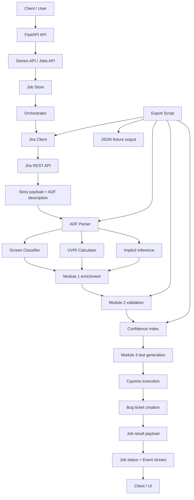

# AIspect System Specification

## 1. Overview

AIspect is a FastAPI-based backend that orchestrates a Jira-driven story-processing pipeline. The current implementation is centered around:

- Fetching Jira stories and media
- Running a staged processing pipeline for a single story
- Exposing job lifecycle APIs for asynchronous execution
- Providing a utility script to export a live Module 2 snapshot for a story

The repository is currently in a **partially implemented state**: the orchestration layer and integrations are present, while several pipeline modules are implemented as deterministic stubs rather than full AI-backed logic.

## 2. Goals

The system aims to:

1. Ingest Jira user stories and their embedded ADF descriptions.
2. Parse and enrich story requirements.
3. Run Module 1, Module 2, and Module 3 processing stages.
4. Provide APIs for job creation, status polling, and Server-Sent Events streaming.
5. Export Module 2 output data for analysis or debugging.

## 3. Current Technology Stack

### Runtime and frameworks
- Python 3.x
- FastAPI
- Uvicorn
- HTTPX
- Pydantic
- python-dotenv

### Key dependencies
- `fastapi>=0.110.0`
- `uvicorn[standard]>=0.27.0`
- `httpx>=0.27.0`
- `pydantic>=2.6.0`
- `python-dotenv>=1.0.0`
- `anthropic>=0.40.0`
- `python-docx>=1.1.0`

## 4. Repository Structure

### Backend entrypoints
- [backend/main.py](backend/main.py)
- [backend/config/settings.py](backend/config/settings.py)

### API layer
- [backend/api/stories.py](backend/api/stories.py)
- [backend/api/jobs.py](backend/api/jobs.py)

### Integrations
- [backend/integrations/jira_client.py](backend/integrations/jira_client.py)

### Job management
- [backend/jobs/job_store.py](backend/jobs/job_store.py)

### Pipeline orchestration
- [backend/pipeline/orchestrator.py](backend/pipeline/orchestrator.py)

### Pipeline modules
- [backend/pipeline/module1/adf_parser.py](backend/pipeline/module1/adf_parser.py)
- [backend/pipeline/module1/screen_classifier.py](backend/pipeline/module1/screen_classifier.py)
- [backend/pipeline/module1/uvri.py](backend/pipeline/module1/uvri.py)
- [backend/pipeline/module1/inference.py](backend/pipeline/module1/inference.py)
- [backend/pipeline/module2/multipass_validator.py](backend/pipeline/module2/multipass_validator.py)
- [backend/pipeline/module2/confidence_index.py](backend/pipeline/module2/confidence_index.py)
- [backend/pipeline/module3/test_generator.py](backend/pipeline/module3/test_generator.py)
- [backend/pipeline/module3/cypress_runner.py](backend/pipeline/module3/cypress_runner.py)

### Scripts
- [backend/scripts/__init__.py](backend/scripts/__init__.py)
- [backend/scripts/export_module2_snapshot.py](backend/scripts/export_module2_snapshot.py)

## 5. Runtime Architecture

### High-level architecture

AIspect uses a layered architecture:

1. **API Layer**: FastAPI routers for stories, jobs, and root health.
2. **Job Store**: In-memory job registry with event queues.
3. **Orchestrator**: Coordinates story processing.
4. **Integrations**: Jira client for fetching stories, attachments, and creating bugs.
5. **Pipeline Modules**: Module 1, Module 2, and Module 3 processing functions.
6. **Utility Scripts**: Export and debugging helpers.

### Data flow diagram



## 6. End-to-end Behavior

### Request flow for a story job

1. A client posts to `/api/jobs` with a `story_key` and optional `app_url`.
2. The API creates a `Job` record in memory and schedules `process_one_story` in the background.
3. The orchestrator fetches the story by key from Jira.
4. The story description is parsed as ADF.
5. Module 1 enriches the story with:
   - screen type classification
   - UVRI calculations
   - implicit acceptance criteria inference
6. Module 2 runs `n` validation passes and computes a confidence index.
7. Module 3 generates tests and optionally runs Cypress if `app_url` is provided.
8. Defects can be turned into Jira bug tickets.
9. Final results are stored in the job and streamed through the SSE endpoint.

## 7. Implemented Features

### 7.1 API features

#### Stories API
- `GET /api/stories`
  - Returns story keys for the configured Jira project.
- `GET /api/stories/debug`
  - Fetches raw Jira search response for diagnostics.
- `GET /api/stories/debug2`
  - Fetches a direct Jira issue (`EXC-1`) and the current authenticated account.

#### Jobs API
- `POST /api/jobs`
  - Starts a job for a given `story_key`.
  - Accepts optional `app_url`.
- `GET /api/jobs/{job_id}`
  - Returns a snapshot of the job state.
- `GET /api/jobs/{job_id}/stream`
  - Streams progress events using Server-Sent Events.

### 7.2 Jira integration

Implemented in [backend/integrations/jira_client.py](backend/integrations/jira_client.py):

- `fetch_story_keys`
  - Retrieves story keys from Jira using JQL.
- `fetch_single_story`
  - Retrieves a full issue, including `summary`, `description`, `priority`, `status`, and attachments.
- `fetch_media_as_base64`
  - Downloads attachment content and returns it as base64.
- `create_bug_ticket`
  - Creates a Jira Bug issue linked to the originating story.

### 7.3 Pipeline orchestration

Implemented in [backend/pipeline/orchestrator.py](backend/pipeline/orchestrator.py):

- Fetches the story
- Parses ADF
- Downloads embedded design media
- Runs Module 1 enrichment
- Runs Module 2 validation
- Runs Module 3 generation and Cypress execution
- Creates bug tickets from failed Cypress defects
- Stores final job result
- Emits progress events

### 7.4 Utility script

Implemented in [backend/scripts/export_module2_snapshot.py](backend/scripts/export_module2_snapshot.py):

- Exports a Module 2 JSON snapshot for a given story key
- Reads story data from Jira
- Parses ADF
- Runs Module 2 validation and confidence computation
- Writes output to `output/module2_output/<story>.json`

Example usage:

```bash
python -m backend.scripts.export_module2_snapshot EXC-1
```

## 8. Current Implementation Details by Module

### 8.1 Module 1

#### ADF parser
- [backend/pipeline/module1/adf_parser.py](backend/pipeline/module1/adf_parser.py)
- Returns a stubbed structure with:
  - `story_text`
  - `nav_path`
  - `explicit_ACs`
  - `media_uuids`

#### Screen classifier
- [backend/pipeline/module1/screen_classifier.py](backend/pipeline/module1/screen_classifier.py)
- Uses keyword matching on `nav_path`.
- Returns one of:
  - `signup`
  - `login`
  - `generic_form`

#### UVRI calculator
- [backend/pipeline/module1/uvri.py](backend/pipeline/module1/uvri.py)
- Returns a deterministic UVRI score and subterm dictionary.
- Currently **not** using the real UVRI formula.

#### Implicit inference
- [backend/pipeline/module1/inference.py](backend/pipeline/module1/inference.py)
- Returns hardcoded acceptance criteria for signup screens.

### 8.2 Module 2

#### Multi-pass validator
- [backend/pipeline/module2/multipass_validator.py](backend/pipeline/module2/multipass_validator.py)
- Returns `n` empty passes.
- No actual model calls are made.

#### Confidence index
- [backend/pipeline/module2/confidence_index.py](backend/pipeline/module2/confidence_index.py)
- Returns an empty list.

### 8.3 Module 3

#### Test generator
- [backend/pipeline/module3/test_generator.py](backend/pipeline/module3/test_generator.py)
- Returns an empty list.

#### Cypress runner
- [backend/pipeline/module3/cypress_runner.py](backend/pipeline/module3/cypress_runner.py)
- Returns an empty list.

## 9. Configuration

Defined in [backend/config/settings.py](backend/config/settings.py):

### Required environment variables
- `JIRA_BASE_URL`
- `JIRA_EMAIL`
- `JIRA_API_TOKEN`
- `JIRA_PROJECT_KEY`

### Optional environment variables
- `ANTHROPIC_API_KEY`
- `CLAUDE_MODEL` (defaults to `claude-sonnet-4-5`)
- `MODULE2_PASSES` (defaults to `5`)
- `CI_HIGH_THRESHOLD` (defaults to `0.80`)
- `CI_MEDIUM_THRESHOLD` (defaults to `0.60`)
- `FRONTEND_ORIGIN` (defaults to `http://localhost:5173`)

## 10. Data Model

### Job
Defined in [backend/jobs/job_store.py](backend/jobs/job_store.py):

- `id`
- `story_key`
- `status` (`pending`, `running`, `completed`, `failed`)
- `current_step`
- `result`
- `error`
- `event_queue`

### Job result payload
The final `job.result` includes:

- `story_key`
- `screen_type`
- `uvri_pre`
- `uvri_post`
- `delta`
- `subterms_pre`
- `subterms_post`
- `explicit_ACs`
- `implicit_ACs`
- `verified_discrepancies`
- `tests`
- `cypress_results`
- `bugs_created`

### Export fixture payload
The export script writes JSON containing:

- `story_key`
- `summary`
- `priority`
- `status`
- `story_text`
- `nav_path`
- `explicit_ACs`
- `media_uuids`
- `design_images_b64`
- `module2_passes`
- `verified_discrepancies`

## 11. Current Features vs Planned Features

| Area | Current state | Notes |
| --- | --- | --- |
| FastAPI backend | Implemented | Core API layer exists |
| Jira story fetch | Implemented | Uses HTTPX and Basic auth |
| Story detail parsing | Implemented | ADF is read and handed to parser |
| Job orchestration | Implemented | Background task + SSE stream |
| CORS configuration | Implemented | Uses `FRONTEND_ORIGIN` |
| Module 1 heuristics | Implemented | Keyword-based screen classification |
| Module 1 UVRI | Stubbed | Deterministic placeholder values |
| Module 1 inference | Stubbed | Hardcoded acceptance criteria |
| Module 2 validation | Stubbed | Returns empty passes |
| Module 2 confidence | Stubbed | Returns empty list |
| Module 3 test generation | Stubbed | Returns empty list |
| Cypress execution | Stubbed | Returns empty list |
| Jira bug creation | Implemented | POSTs bug issues to Jira |
| Export fixture script | Implemented | Generates JSON fixture for Module 2 |
| Anthropic / LLM integration | Not wired | Environment variables exist, no live calls yet |

## 12. Current Limitations

- No real model-backed inference is wired in yet.
- `Module 2` and `Module 3` are placeholders.
- `UVRI` is not computed using the real formula.
- The system relies on in-memory job storage, so jobs are lost on restart.
- There is no automated test suite in the current repository.
- The `ANTHROPIC_API_KEY` and `CLAUDE_MODEL` settings are present, but no code path uses them yet.
- The export script depends on Jira access and the current story being present in Jira.

## 13. Operational Notes

### Startup
The backend is intended to be run with Uvicorn, for example:

```bash
uvicorn backend.main:app --reload
```

### Environment
The system expects a `.env` file at the repository root containing Jira and optional AI credentials.

### Observable behavior
- Successful jobs emit progress events such as `fetching_ticket`, `parsing_adf`, `module2_started`, `module2_done`, and `done`.
- Failed jobs emit `error` events.

## 14. Recommended Next Steps

1. Replace Module 1 stubs with real LLM-backed logic.
2. Implement real Module 2 validation passes.
3. Implement real confidence scoring.
4. Implement test generation and Cypress execution.
5. Add persistent job storage.
6. Add automated tests for APIs, orchestration, and Jira integration.
7. Wire Anthropic usage into the pipeline modules.

## 15. Summary

AIspect currently provides a functional FastAPI skeleton with Jira integration, background job orchestration, Server-Sent Events, and a Module 2 export utility. The main missing pieces are the actual AI-driven pipeline implementations for Module 1, Module 2, and Module 3, which are currently stubbed or heuristic-based.
